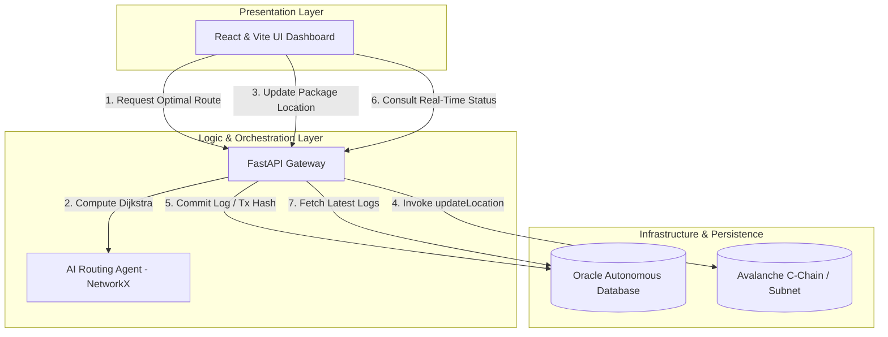

# 🌊 Waterline Protocol
### The Web3, AI & Oracle Cloud Hybrid Infrastructure for RWA Logistics Optimization
---

**Waterline Protocol** is a state-of-the-art enterprise-grade logistics protocol designed to merge high-performance data resilience, artificial intelligence, and decentralized consensus. By leveraging **Oracle Cloud Infrastructure (OCI)**, **Avalanche Blockchain Network**, and **Graph-based AI Agents**, Waterline provides unmatched tamper-proof package tracking, real-time cryptographic proof-of-delivery (RWA), and AI-driven supply chain routing optimization.

---

## 🏛️ Hybrid System Architecture

Waterline Protocol integrates three modern technological paradigms into a unified, secure system:



1. **Decentralized State Machine (Web3 - Avalanche EncryptedERC)**: Avalanche Fuji Testnet hosts the core logistics state machine via the confidential `WaterlineProtocol` contract. Fully aligned with the **Avalanche EncryptedERC** specifications, the system replaces transparent geographical locations with a highly secure on-chain `estring` struct containing encrypted `ciphertext` payloads. By conducting client-side ElGamal/Poseidon-based encryption before dispatching transaction payloads, Waterline achieves complete "On-Chain Supply Chain Privacy," rendering real-time transit corridors invisible to public miners and third-party competitors to safeguard corporate secrets.
2. **Enterprise Persistence & Relational Logs (Oracle DB)**: The FastAPI orchestrator uses native Oracle Thin Mode (`oracledb`) to maintain transactional history (`package_logs`). It securely stores the hex-encoded location ciphertexts matched against EVM transaction hashes (`tx_hash`) to enable compliance, auditing, and secure zero-knowledge state mapping without violating cryptographic confidentiality.
3. **Graph-Based Routing Agent (AI)**: An intelligent routing module uses the Dijkstra shortest-path algorithm (via `networkx`) to compute optimal transport corridors across nodes, forecasting travel distances and estimating times of arrival (ETA) at 80 km/h baseline speeds.

## 🎨 Nuevas Funcionalidades Demos (MVP)
Para facilitar pruebas locales y presentaciones rápidas, se implementaron mejoras en la interfaz de usuario y arquitectura local:
*   **🌍 Mapa Interactivo Real-time**: La interfaz ahora integra `react-leaflet`, dibujando los nodos propuestos por la IA directamente sobre un mapa global (con tema Dark Matter) y uniendo los puntos logísticos en un recorrido renderizado de manera automática.
*   **⏳ Línea de Tiempo (Stepper) Completa**: El Portal de Trazabilidad RWA consolida todo el historial de la base de datos de Oracle, visualizando cada etapa por donde pasó el paquete utilizando una interfaz vertical en forma de línea de tiempo con su estado encriptado.
*   **🔗 Enlaces Directos a Snowtrace**: Cada *Transaction Hash (TxID)* de Avalanche generado por la dApp enlaza de forma automática hacia [testnet.snowtrace.io](https://testnet.snowtrace.io), permitiendo auditar la veracidad On-Chain de tu transacción simulada, instantáneamente en otra pestaña.
*   **🛠️ Mock Mode (Simulación Blockchain Local)**: Si tu archivo `backend/.env` tiene la private key vacía/default (`0x000...`), el protocolo enciende el *Mock Mode*. Esto simulará el retraso por confirmación de nodos de Avalanche y devolverá una operación exitosa local para que toda la DApp pueda ejecutarse correctamente sin requerir setups EVM exhaustivos.

---


## ⛓️ HumanityChain — Complete Quality Blockchain Blueprint (90 días)

### ¿Qué es?
**HumanityChain** es una blockchain omnichain de calidad completa, diseñada como proyecto soberano y separado: **no está asociada a Waterline ni a ningún otro proyecto previo**. Su misión es resolver problemas humanos críticos con transparencia, velocidad y costos accesibles.

### ¿Qué hace?
- **Coordina trazabilidad crítica** para salud, alimentos, emergencias y logística humanitaria.
- **Sincroniza estado entre múltiples dominios** para alta disponibilidad y resiliencia.
- **Habilita experiencia gasless** para usuarios finales mediante relayer/paymaster dedicado.
- **Aplica reglas de prioridad humanitaria** auditables y verificables.
- **Entrega métricas de impacto social** en tiempo real para toma de decisiones.

### ¿Por qué existe?
Porque los sistemas actuales suelen ser caros, opacos o fragmentados. HumanityChain propone una base abierta y verificable para operaciones donde el tiempo y la confiabilidad salvan vidas.

### Principio irrenunciable: No Daño Humano
HumanityChain se define bajo un principio absoluto: **no debe utilizarse para causar daño a ningún ser humano**. Cualquier implementación, integración o despliegue debe incluir mecanismos de prevención, monitoreo y bloqueo ante usos abusivos.

### Derechos de uso universal
- **Acceso abierto sin discriminación**: cualquier persona u organización puede usar HumanityChain sin distinción de país, clase social, tamaño empresarial o capacidad económica.
- **Neutralidad económica**: diseño pensado para que pequeños actores puedan operar en igualdad funcional con grandes empresas.
- **Interoperabilidad pública**: estándares abiertos para que terceros integren sin barreras propietarias.

### Adopción inclusiva para empresas y comunidades
- **Mismo estándar para todos**: pymes, cooperativas, ONGs, gobiernos locales y grandes corporaciones operan sobre las mismas reglas.
- **Costos previsibles y transparentes**: estructura de costos clara para facilitar entrada de organizaciones pequeñas.
- **Integración gradual**: APIs y módulos para adopción por etapas sin reemplazo total inmediato.

### Cobertura de usos humanos (enfoque generalista)
HumanityChain está diseñada para servir múltiples necesidades humanas legítimas: logística, salud, abastecimiento, educación, trazabilidad productiva, coordinación de emergencias, comercio y servicios digitales, siempre bajo el principio de no daño humano.

### Accesibilidad universal (ciegos, sordos, mudos y más)
Para que nadie quede fuera, HumanityChain debe adoptar accesibilidad como requisito de arquitectura, no como extra opcional:
- **Personas ciegas o con baja visión**: soporte completo para lectores de pantalla, navegación por teclado, etiquetas ARIA, alto contraste y contenido compatible con braille digital.
- **Personas sordas o hipoacúsicas**: alertas visuales equivalentes, subtítulos y transcripción en tiempo real para contenidos audiovisuales y soporte en lengua de señas en canales críticos.
- **Personas mudas o con dificultades del habla**: flujos 100% textuales, comandos asistidos, plantillas de comunicación rápida y autenticación sin dependencia de voz.
- **Diseño multimodal para todos**: texto, visual, vibración/háptico y notificaciones estructuradas para distintos contextos de uso.

### Qué le falta hoy y cómo mejorarlo (prioridad alta)
- **Falta una política formal de accesibilidad** → crear estándar interno alineado con **WCAG 2.2 AA** para frontend, paneles y documentación.
- **Faltan criterios verificables** → agregar KPIs de inclusión (tasa de tareas completadas por usuarios con asistencia, tiempo medio de operación accesible, errores por barrera).
- **Falta validación real con usuarios** → ejecutar pruebas de usabilidad con personas ciegas, sordas y mudas antes de cada release mayor.
- **Falta accesibilidad en incidentes** → playbooks de emergencia con formatos accesibles (texto simple, visual, subtitulado y lectura automatizada).
- **Falta gobernanza inclusiva** → comité de accesibilidad con participación de comunidades usuarias y revisión trimestral de cumplimiento.

### Canales de acceso por tipo de persona (inclusión total)
- **App móvil accesible** (Android/iOS): lector de pantalla, navegación por gestos y modo alto contraste.
- **Web universal**: teclado completo, subtitulado, lenguaje claro y soporte multilenguaje.
- **Canal asistido por mensajería**: operaciones guiadas por chat para personas con baja alfabetización digital.
- **Modo offline/low-bandwidth**: confirmaciones diferidas y sincronización cuando vuelve la conectividad.
- **Centros de atención comunitaria**: operación asistida para personas mayores o con barreras tecnológicas.

### Super-app internacional (inspiración tipo WeChat, con enfoque abierto)
HumanityChain puede evolucionar a una **super-app interoperable** que unifique servicios cotidianos sobre blockchain:
- **Pagos**: transferencias, cobros QR y liquidación trazable.
- **Identidad verificable**: credenciales descentralizadas (DID/VC) para KYC portable y privacidad selectiva.
- **Viajes y movilidad**: tickets, reservas, seguros y validaciones fronterizas compatibles con regulaciones locales.
- **Servicios cívicos y comerciales**: acceso a ayudas, facturación, certificaciones y contratos digitales.
- **Motor de cumplimiento internacional**: reglas por jurisdicción (AML/KYC, protección de datos, fiscalidad) sin romper UX.

### Requisitos para uso internacional
- **Arquitectura multi-país**: dominios regionales + estándar común `HCMessage` para interoperar globalmente.
- **Cumplimiento por capas**: módulos configurables por región (GDPR/privacidad, AML, sanciones, identidad).
- **Localización completa**: idioma, moneda, formatos legales y accesibilidad cultural.
- **Gobernanza global inclusiva**: representación de comunidades, pymes, ONGs y grandes empresas en decisiones clave.
- **Portabilidad de cuenta y reputación**: una identidad usable en distintos países y servicios.

### Principios de calidad completa (v1)
- **Independencia total**: marca, contratos, red, infraestructura y gobernanza propias de HumanityChain.
- **Seguridad por diseño**: hardening multicapa, pruebas de estrés y control anti-replay desde el protocolo.
- **Escalabilidad práctica**: arquitectura modular omnichain preparada para crecimiento regional.
- **Costo operativo eficiente**: costo casi cero para usuario final con trazabilidad del subsidio.
- **Impacto humano medible**: toda mejora técnica debe mapear a una mejora social concreta.

### Alcance funcional (MVP)
1. **Dominio canónico HumanityChain Hub** con estado oficial de operaciones.
2. **2 dominios Spoke EVM** para replicación de estado y continuidad operativa.
3. **Estándar de mensajería `HCMessage v1`** (hash, nonce, domain, replay-protection).
4. **Relayer Network + Paymaster** propios de HumanityChain para UX gasless.
5. **Motor de priorización humanitaria** con perfiles por criticidad (`medical`, `food`, `emergency`, `standard`).

### Arquitectura mínima independiente
- **HumanityHub.sol**: contrato canónico de estados, custodia y eventos críticos.
- **HumanitySpoke.sol**: contratos espejo para sincronización verificada por mensaje.
- **Humanity Relayer**: cola transaccional, idempotencia, reintentos y reconciliación cross-domain.
- **Impact Ledger**: almacenamiento de auditoría y KPIs sociales por operación.
- **Policy Engine**: reglas auditables para priorización y límites de riesgo.

### Métricas de éxito (producto + impacto)
- p95 API `< 400ms` (sin finalización on-chain).
- Confirmación UX `< 2s` en estado `pending`.
- Costo usuario final = `0` en ≥ 97% de operaciones.
- Integridad omnichain: 0 pérdidas de eventos tras política de reintentos.
- Reducción de tiempo en envíos críticos ≥ 25% en piloto.
- Disponibilidad operacional ≥ 99.9% en ventana mensual.


### Estado de implementación actual (base creada)
- ✅ Endpoint operativo `POST /v1/humanity/operation/update` en backend (`FastAPI`) con:
  - `message_id` determinístico (`sha256`) sobre operación + payload.
  - Idempotencia básica (si se repite, marca estado `replayed`).
  - Emisión por WebSocket de evento `HUMANITY_OPERATION_UPDATED`.
- ✅ Endpoint `GET /v1/humanity/operations` para consulta de operaciones registradas.
- ✅ Contratos base creados:
  - `contracts/HumanityHub.sol`
  - `contracts/HumanitySpoke.sol`


### Checklist para dejarla lista para despliegue
- [x] Contratos base `HumanityHub.sol` y `HumanitySpoke.sol` creados.
- [x] Endpoint de creación de operación omnichain (`POST /v1/humanity/operation/update`).
- [x] Endpoint de transición de estado (`POST /v1/humanity/operation/state`).
- [x] Endpoint de salud operativa HumanityChain (`GET /v1/humanity/health`) para monitoreo.
- [x] Endpoint de métricas operativas (`GET /v1/humanity/metrics`) para observabilidad básica.
- [x] Endpoint paginado de operaciones (`GET /v1/humanity/operations/paginated`) y persistencia atómica en disco.
- [x] Endpoint de filtrado (`GET /v1/humanity/operations/filter`) e índices SQLite para consultas por estado/tiempo.
- [x] Persistencia dual JSON + SQLite (`HUMANITY_DB_PATH`) para mayor resiliencia local y recuperación de estado.
- [x] Persistencia local de operaciones para no perder datos al reiniciar backend.
- [x] Validaciones anti-abuso en API: límite de payload, chains permitidas, sin duplicados y límites de fanout.
- [x] Rate limiting configurable por API key para reducir abuso y flooding.
- [x] Rate limiting adicional por IP (`HUMANITY_IP_RATE_LIMIT_*`) para endurecer perímetro de API.
- [x] Trazabilidad temporal (`created_at`/`updated_at`) y control de conflicto por `operation_id` para consistencia.
- [x] Máquina de estados con transiciones válidas (protección ante cambios inconsistentes).
- [x] Controles adicionales on-chain en Hub/Spoke (`operationId` y `messageHash` no nulos, perfil crítico acotado).
- [x] Suite inicial de tests API para flujo HumanityChain y tests de contratos base con Foundry.
- [x] Guía de despliegue de contratos base (`contracts/README.md`) para testnet/mainnet.
- [ ] Auditoría externa + bug bounty (ver `SECURITY.md`).
- [x] Runbook inicial de monitoreo/SLO/SLA (`backend/monitoring_runbook.md`).

### Backlog técnico priorizado
- [x] Publicar especificación `HCMessage v1` + vectores de prueba (`contracts/HCMessage_v1.md`).
- [ ] Implementar `HumanityHub.sol` y `HumanitySpoke.sol` como contratos base.
- [ ] Exponer endpoint `POST /v1/humanity/operation/update` con `criticality_profile`.
- [ ] Persistir estados: `queued`, `sent`, `acknowledged`, `finalized`, `failed`, `replayed`.
- [ ] Añadir pruebas de caos: caída RPC, reorder, replay, duplicado y partición de red.
- [ ] Integrar observabilidad con alertas SLO/SLA y tablero de impacto humano.
- [ ] Ejecutar auditoría externa y bug bounty antes de piloto público.

## 💻 Detailed Tech Stack

| Component | Technology | Description / Usage |
| :--- | :--- | :--- |
| **Smart Contract** | Solidity (`^0.8.0`) + eERC | Integrates customized confidential `estring` structs, client-side encryption interfaces, and native `onlyOwner` access control mechanisms. |
| **Backend Framework** | FastAPI (Python) | High-performance asynchronous API gateway, processing cryptographic client-side masking and handling DB connection pools. |
| **Consensus Engine** | Web3.py & Avalanche C-Chain / eERC | Connects to Avalanche Fuji, compiling and signing EVM transactions packed with confidential homomorphic payloads. |
| **Database** | Oracle Autonomous DB (`oracledb`) | Multi-model database storing high-speed encrypted location ciphertexts and execution logs in Thin Mode. |
| **AI Routing Agent** | NetworkX | Python library for dynamic graph optimization, implementing shortest-path Dijkstra algorithms. |
| **Frontend UI** | React + Vite | Clean, state-driven dashboard built with modern component architectures for real-time visualization. |

---

## 📋 Prerequisites

To run Waterline Protocol locally or deploy it to a staging environment, make sure you have the following prerequisites installed:

* **Python 3.10+** (Recommended) or **Python 3.11/3.12**
* **Node.js v18.0.0+** and **npm**
* Access to an **Oracle Database** instance (Local XE, Autonomous Database on OCI, or Docker container)
* An EVM-compatible wallet (e.g. MetaMask) with some **Avalanche Fuji Testnet AVAX**
* A valid RPC endpoint for Avalanche Fuji

---

## 🚀 Setup & Installation

### 1. Smart Contract Deployment
Use standard tools like **Hardhat**, **Foundry**, or **Remix IDE** to deploy the smart contract `waterline.sol`.
1. Compile the contract using Solidity Compiler `^0.8.0`.
2. Deploy it to Avalanche Fuji Testnet.
3. Save the **Contract Address** for the backend configuration.

### 2. Backend Orchestration Setup
Go to the `backend` directory:
```bash
cd backend
```

Create and activate a virtual environment:
```bash
# Windows
python -m venv venv
venv\Scripts\activate

# macOS / Linux
python3 -m venv venv
source venv/bin/activate
```

Install the dependencies:
```bash
pip install -r requirements.txt
```

Configure your environment variables. Copy the template:
```bash
cp .env.example .env
```
Open `.env` and fill in your actual credentials:
```env
ORACLE_USER=admin
ORACLE_PASSWORD=your_secure_oracle_password
ORACLE_DSN=your_oracle_dsn_or_connect_string
AVALANCHE_RPC_URL=https://api.avax-test.network/ext/bc/C/rpc
CONTRACT_ADDRESS=0xYourDeployedContractAddress
PRIVATE_KEY=0xYourPrivateKeyForSigningTx
ACCOUNT_ADDRESS=0xYourAccountAddressAssociatedWithPrivateKey
```

Start the backend server using Uvicorn:
```bash
python main.py
```
The backend API will be available at **`http://localhost:8000`** with full swagger docs at `/docs`.

### 3. Frontend Dashboard Setup
Go to the `frontend` directory:
```bash
cd ../frontend
```

Install npm dependencies:
```bash
npm install
```

Configure environment variables. Copy the template:
```bash
cp .env.example .env
```
Ensure your `.env` points to the active backend:
```env
VITE_API_URL=http://localhost:8000
```

Start the Vite development server:
```bash
npm run dev
```
The user interface dashboard will run at **`http://localhost:5173`** (or another port outputted in the terminal console).

---

## 🔌 API Reference & Endpoints

### 1. Health Status
* **Endpoint**: `GET /`
* **Description**: Verifies that the API gateway is fully operational.
* **Response**:
```json
{
  "status": "ok",
  "message": "Waterline Protocol API corriendo correctamente"
}
```

### 2. Retrieve Package Status (Oracle DB Integration)
* **Endpoint**: `GET /package/{id}`
* **Description**: Consults the `package_logs` table in Oracle DB to find the latest real-time location and tx hash registered for a specific package.
* **Success Response (200 OK)**:
```json
{
  "status": "success",
  "data": {
    "package_id": 42,
    "current_location": "Rosario",
    "last_tx_hash": "0x5e3c8..."
  }
}
```
* **Error Response (404 Not Found)**:
```json
{
  "detail": "Paquete no encontrado en la base de datos."
}
```

### 3. Update Package Location (Avalanche EVM + Oracle DB Commit)
* **Endpoint**: `POST /package/update`
* **Description**: Builds, signs, and sends an EVM transaction calling the `updateLocation` function on the smart contract, waits for block confirmation, and records the success logs inside the Oracle database.
* **Body Request**:
```json
{
  "package_id": 42,
  "new_location": "Rosario"
}
```
* **Response**:
```json
{
  "status": "success",
  "message": "Paquete 42 actualizado a 'Rosario' de forma exitosa.",
  "tx_hash": "0x4fb8ea..."
}
```

### 4. AI-Driven Route Optimization
* **Endpoint**: `GET /route/optimize`
* **Query Parameters**:
  * `origin`: Name of origin city (e.g. `CABA`)
  * `destination`: Name of destination city (e.g. `Salta`)
* **Description**: The graph agent processes the input nodes, applies Dijkstra shortest-path calculations, and yields distances, optimum path sequence, and projected ETA hours.
* **Success Response (200 OK)**:
```json
{
  "origin": "CABA",
  "destination": "Salta",
  "optimal_route": ["CABA", "Rosario", "Salta"],
  "total_distance_km": 1400.0,
  "estimated_time_hours": 17.5
}
```


## 🔐 Security & Operations
- Política de seguridad: `SECURITY.md`
- Runbook de monitoreo e incidentes: `backend/monitoring_runbook.md`


## ✅ Final Go-Live Checklist
- Checklist de despliegue final: `DEPLOY_CHECKLIST.md`


## 🧪 Smoke Test rápido
- Ejecutar: `API_KEY=... BASE_URL=http://localhost:8000 python backend/smoke_test_humanity.py`
