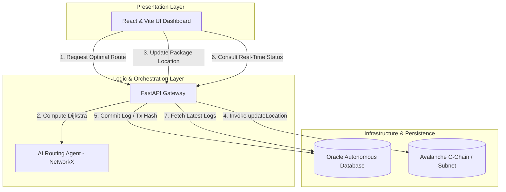

# 🌊 Waterline Protocol
### The Web3, AI & Oracle Cloud Hybrid Infrastructure for RWA Logistics Optimization
---

**Waterline Protocol** is a state-of-the-art enterprise-grade logistics protocol designed to merge high-performance data resilience, artificial intelligence, and decentralized consensus. By leveraging **Oracle Cloud Infrastructure (OCI)**, **Avalanche Blockchain Network**, and **Graph-based AI Agents**, Waterline provides unmatched tamper-proof package tracking, real-time cryptographic proof-of-delivery (RWA), and AI-driven supply chain routing optimization.

---

## 🏛️ Hybrid System Architecture

Waterline Protocol integrates three modern technological paradigms into a unified, secure system:



1. **Decentralized State Machine (Web3 - Avalanche EncryptedERC)**: Avalanche Fuji Testnet hosts the core logistics state machine via the confidential `WaterlineProtocol` contract. Fully aligned with the **Avalanche EncryptedERC** specifications, the system replaces transparent geographical locations with a highly secure on-chain `estring` struct containing encrypted `ciphertext` payloads. By conducting client-side ElGamal/Poseidon-based encryption before dispatching transaction payloads, Waterline achieves complete "On-Chain Supply Chain Privacy," rendering real-time transit corridors invisible to public miners and third-party competitors to safeguard corporate secrets.
2. **Enterprise Persistence & Relational Logs (Oracle DB)**: The FastAPI orchestrator uses native Oracle Thin Mode (`oracledb`) to maintain transactional history (`package_logs`). It securely stores the hex-encoded location ciphertexts matched against EVM transaction hashes (`tx_hash`) to enable compliance, auditing, and secure zero-knowledge state mapping without violating cryptographic confidentiality.
3. **Graph-Based Routing Agent (AI)**: An intelligent routing module uses the Dijkstra shortest-path algorithm (via `networkx`) to compute optimal transport corridors across nodes, forecasting travel distances and estimating times of arrival (ETA) at 80 km/h baseline speeds.

## 🎨 Nuevas Funcionalidades Demos (MVP)
Para facilitar pruebas locales y presentaciones rápidas, se implementaron mejoras en la interfaz de usuario y arquitectura local:
*   **🌍 Mapa Interactivo Real-time**: La interfaz ahora integra `react-leaflet`, dibujando los nodos propuestos por la IA directamente sobre un mapa global (con tema Dark Matter) y uniendo los puntos logísticos en un recorrido renderizado de manera automática.
*   **⏳ Línea de Tiempo (Stepper) Completa**: El Portal de Trazabilidad RWA consolida todo el historial de la base de datos de Oracle, visualizando cada etapa por donde pasó el paquete utilizando una interfaz vertical en forma de línea de tiempo con su estado encriptado.
*   **🔗 Enlaces Directos a Snowtrace**: Cada *Transaction Hash (TxID)* de Avalanche generado por la dApp enlaza de forma automática hacia [testnet.snowtrace.io](https://testnet.snowtrace.io), permitiendo auditar la veracidad On-Chain de tu transacción simulada, instantáneamente en otra pestaña.
*   **🛠️ Mock Mode (Simulación Blockchain Local)**: Si tu archivo `backend/.env` tiene la private key vacía/default (`0x000...`), el protocolo enciende el *Mock Mode*. Esto simulará el retraso por confirmación de nodos de Avalanche y devolverá una operación exitosa local para que toda la DApp pueda ejecutarse correctamente sin requerir setups EVM exhaustivos.

---

## 💻 Detailed Tech Stack

| Component | Technology | Description / Usage |
| :--- | :--- | :--- |
| **Smart Contract** | Solidity (`^0.8.0`) + eERC | Integrates customized confidential `estring` structs, client-side encryption interfaces, and native `onlyOwner` access control mechanisms. |
| **Backend Framework** | FastAPI (Python) | High-performance asynchronous API gateway, processing cryptographic client-side masking and handling DB connection pools. |
| **Consensus Engine** | Web3.py & Avalanche C-Chain / eERC | Connects to Avalanche Fuji, compiling and signing EVM transactions packed with confidential homomorphic payloads. |
| **Database** | Oracle Autonomous DB (`oracledb`) | Multi-model database storing high-speed encrypted location ciphertexts and execution logs in Thin Mode. |
| **AI Routing Agent** | NetworkX | Python library for dynamic graph optimization, implementing shortest-path Dijkstra algorithms. |
| **Frontend UI** | React + Vite | Clean, state-driven dashboard built with modern component architectures for real-time visualization. |

---

## 📋 Prerequisites

To run Waterline Protocol locally or deploy it to a staging environment, make sure you have the following prerequisites installed:

* **Python 3.10+** (Recommended) or **Python 3.11/3.12**
* **Node.js v18.0.0+** and **npm**
* Access to an **Oracle Database** instance (Local XE, Autonomous Database on OCI, or Docker container)
* An EVM-compatible wallet (e.g. MetaMask) with some **Avalanche Fuji Testnet AVAX**
* A valid RPC endpoint for Avalanche Fuji

---

## 🚀 Setup & Installation

### 1. Smart Contract Deployment
Use standard tools like **Hardhat**, **Foundry**, or **Remix IDE** to deploy the smart contract `waterline.sol`.
1. Compile the contract using Solidity Compiler `^0.8.0`.
2. Deploy it to Avalanche Fuji Testnet.
3. Save the **Contract Address** for the backend configuration.

### 2. Backend Orchestration Setup
Go to the `backend` directory:
```bash
cd backend
```

Create and activate a virtual environment:
```bash
# Windows
python -m venv venv
venv\Scripts\activate

# macOS / Linux
python3 -m venv venv
source venv/bin/activate
```

Install the dependencies:
```bash
pip install -r requirements.txt
```

Configure your environment variables. Copy the template:
```bash
cp .env.example .env
```
Open `.env` and fill in your actual credentials:
```env
ORACLE_USER=admin
ORACLE_PASSWORD=your_secure_oracle_password
ORACLE_DSN=your_oracle_dsn_or_connect_string
AVALANCHE_RPC_URL=https://api.avax-test.network/ext/bc/C/rpc
CONTRACT_ADDRESS=0xYourDeployedContractAddress
PRIVATE_KEY=0xYourPrivateKeyForSigningTx
ACCOUNT_ADDRESS=0xYourAccountAddressAssociatedWithPrivateKey
```

Start the backend server using Uvicorn:
```bash
python main.py
```
The backend API will be available at **`http://localhost:8000`** with full swagger docs at `/docs`.

### 3. Frontend Dashboard Setup
Go to the `frontend` directory:
```bash
cd ../frontend
```

Install npm dependencies:
```bash
npm install
```

Configure environment variables. Copy the template:
```bash
cp .env.example .env
```
Ensure your `.env` points to the active backend:
```env
VITE_API_URL=http://localhost:8000
```

Start the Vite development server:
```bash
npm run dev
```
The user interface dashboard will run at **`http://localhost:5173`** (or another port outputted in the terminal console).

---

## 🔌 API Reference & Endpoints

### 1. Health Status
* **Endpoint**: `GET /`
* **Description**: Verifies that the API gateway is fully operational.
* **Response**:
```json
{
  "status": "ok",
  "message": "Waterline Protocol API corriendo correctamente"
}
```

### 2. Retrieve Package Status (Oracle DB Integration)
* **Endpoint**: `GET /package/{id}`
* **Description**: Consults the `package_logs` table in Oracle DB to find the latest real-time location and tx hash registered for a specific package.
* **Success Response (200 OK)**:
```json
{
  "status": "success",
  "data": {
    "package_id": 42,
    "current_location": "Rosario",
    "last_tx_hash": "0x5e3c8..."
  }
}
```
* **Error Response (404 Not Found)**:
```json
{
  "detail": "Paquete no encontrado en la base de datos."
}
```

### 3. Update Package Location (Avalanche EVM + Oracle DB Commit)
* **Endpoint**: `POST /package/update`
* **Description**: Builds, signs, and sends an EVM transaction calling the `updateLocation` function on the smart contract, waits for block confirmation, and records the success logs inside the Oracle database.
* **Body Request**:
```json
{
  "package_id": 42,
  "new_location": "Rosario"
}
```
* **Response**:
```json
{
  "status": "success",
  "message": "Paquete 42 actualizado a 'Rosario' de forma exitosa.",
  "tx_hash": "0x4fb8ea..."
}
```

### 4. AI-Driven Route Optimization
* **Endpoint**: `GET /route/optimize`
* **Query Parameters**:
  * `origin`: Name of origin city (e.g. `CABA`)
  * `destination`: Name of destination city (e.g. `Salta`)
* **Description**: The graph agent processes the input nodes, applies Dijkstra shortest-path calculations, and yields distances, optimum path sequence, and projected ETA hours.
* **Success Response (200 OK)**:
```json
{
  "origin": "CABA",
  "destination": "Salta",
  "optimal_route": ["CABA", "Rosario", "Salta"],
  "total_distance_km": 1400.0,
  "estimated_time_hours": 17.5
}
```
